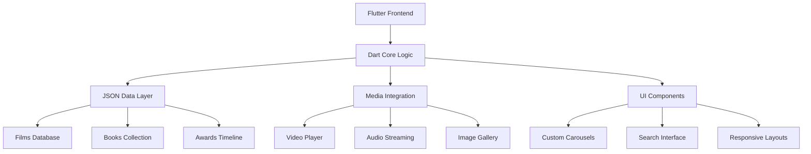

# 🎬 Tribute to Satyajit Ray - Flutter App

<div align="center">


**🎭 A Digital Journey Through the Master's Universe**

[](https://flutter.dev/)
[](https://dart.dev/)
[](https://github.com/AmlanWTK/TributeToSatyajitRay)

[](https://vimeo.com/1095249423/eb295afc96)

*"The only solutions are aesthetic. All other solutions are fraudulent."* - Satyajit Ray

</div>

---

## 🌟 About This Project

This **Flutter application** is a heartfelt digital homage to **Satyajit Ray** (1921-1992), the legendary filmmaker, writer, illustrator, and cultural icon who revolutionized Indian cinema. More than just a portfolio app, this is an immersive experience that celebrates Ray's multifaceted genius through interactive storytelling, rich multimedia content, and cultural preservation.

### 🎯 **Vision & Purpose**
- **Cultural Preservation**: Digitally archive Ray's vast creative legacy
- **Educational Impact**: Introduce new generations to Ray's timeless work
- **Interactive Experience**: Engage users through multimedia storytelling
- **Accessibility**: Make Ray's work discoverable and accessible worldwide

---

## ✨ Feature Showcase

<table>
<tr>
<td width="33%" align="center">

### 🎞️ **Cinematic Journey**


**Explore Ray's Filmography**
- Year-wise movie exploration
- IMDb integration with ratings
- Trailer previews & streaming links
- Award-winning film highlights
- Behind-the-scenes content

</td>
<td width="33%" align="center">

### ✍️ **Literary Universe**


**Dive into Ray's Stories**
- **Feluda** detective series
- **Professor Shonku** sci-fi tales  
- **Tarini Khuro** adventure stories
- Bilingual support (Bangla/English)
- Interactive screenplay reading

</td>
<td width="33%" align="center">

### 🎵 **Musical Genius**


**Discover Ray's Compositions**
- Original film scores
- Background music collections
- Musical influences & inspirations
- Audio player integration
- Composer's notes & insights

</td>
</tr>
</table>

### 🏆 **Comprehensive Experience**

<details>
<summary><b>🎭 Complete Feature List</b></summary>

| Feature Category | Description | Interactive Elements |
|-----------------|-------------|---------------------|
| **🎬 Iconic Films** | Complete filmography with metadata | Search, filter, watch trailers, IMDb links |
| **📖 Literary Works** | Stories, screenplays, and writings | Read in-app, language toggle, bookmarks |
| **🌱 Roots & Biography** | Life journey from childhood to legacy | Timeline, photo gallery, milestones |
| **🤔 Lesser-Known Facts** | Hidden gems about Ray's life | Interactive cards, trivia, quotes |
| **🏅 Awards Timeline** | Oscar, Bharat Ratna, and international honors | Chronological view, achievement details |
| **📚 Books About Ray** | Biographies and critical analyses | Carousel view, in-app reading, reviews |
| **🎥 Documentaries** | Films made on Ray's life and work | Streaming integration, director's notes |
| **🎙️ Rare Interviews** | Ray discussing his creative process | Audio/video player, transcripts |
| **📰 Sandesh Legacy** | Family magazine through generations | Historical context, original illustrations |
| **🖼️ Visual Gallery** | Rare photos, sketches, and tributes | High-resolution viewing, zoom, share |

</details>

---

## 🛠️ Technical Architecture

<div align="center">

### App Architecture Overview


</div>

### 🚀 **Technology Stack**

| Component | Technology | Purpose |
|-----------|------------|---------|
| **📱 Framework** |  | Cross-platform mobile development |
| **💻 Language** |  | Primary programming language |
| **🎥 Video** | Custom Video Player | Trailer and documentary playback |
| **🖼️ Images** | Imgur Integration | Optimized image hosting and delivery |
| **📊 Data** | JSON Structure | Lightweight content management |
| **🌐 Fonts** | Unicode Support | Bangla and English typography |
| **🎨 UI/UX** | Material Design | Native Flutter components |

### 🏗️ **Key Technical Features**

<table>
<tr>
<td width="50%">

#### **🎯 Performance Optimizations**
- Lazy loading for large media collections
- Efficient image caching and compression
- Optimized JSON parsing for fast data access
- Smooth animations with minimal memory footprint

</td>
<td width="50%">

#### **📱 User Experience**
- Responsive design for all screen sizes
- Intuitive navigation with hero animations
- Search functionality across all content types
- Offline reading capability for key content

</td>
</tr>
<tr>
<td width="50%">

#### **🌐 Content Management**
- Structured JSON for easy content updates
- Multilingual support with Unicode rendering
- External link integration (IMDb, streaming)
- Rich media embedding and playback

</td>
<td width="50%">

#### **🎨 Visual Design**
- Custom carousel implementations
- Fade-in animations and scroll effects
- Material Design principles
- Cultural aesthetics reflecting Ray's style

</td>
</tr>
</table>

---

## 📱 User Journey & Screenshots

<div align="center">

### 🎬 **App Preview**

[](https://vimeo.com/1095249423/eb295afc96)

*Click above to watch the complete app walkthrough*

</div>

### 📸 **Feature Highlights**

<table>
<tr>
<td width="25%" align="center">

**🏠 Home Screen**
*Elegant entry point with Ray's portrait and key navigation*

</td>
<td width="25%" align="center">

**🎞️ Films Gallery**
*Interactive filmography with search and filter options*

</td>
<td width="25%" align="center">

**📚 Story Reader**
*Immersive reading experience with bilingual support*

</td>
<td width="25%" align="center">

**🎵 Music Player**
*Dedicated player for Ray's musical compositions*

</td>
</tr>
</table>

---

## 🚀 Getting Started

### 📋 **Prerequisites**

```bash
Flutter SDK: >=3.0.0
Dart SDK: >=3.0.0
Android Studio / VS Code
Git
```

### ⚡ **Quick Setup**

<details>
<summary><b>Click to expand installation guide</b></summary>

1. **Clone the repository**
   ```bash
   git clone https://github.com/AmlanWTK/TributeToSatyajitRay.git
   cd TributeToSatyajitRay
   ```

2. **Install dependencies**
   ```bash
   flutter pub get
   ```

3. **Check Flutter setup**
   ```bash
   flutter doctor
   ```

4. **Run on device/emulator**
   ```bash
   flutter run
   ```

5. **Build for production**
   ```bash
   # Android
   flutter build apk --release
   
   # iOS  
   flutter build ios --release
   ```

</details>

---

## 📂 Project Structure

```
TributeToSatyajitRay/
├── 📱 lib/
│   ├── 🏠 main.dart                    # App entry point
│   ├── 🎬 screens/
│   │   ├── films_screen.dart           # Movie exploration
│   │   ├── stories_screen.dart         # Literary works
│   │   ├── biography_screen.dart       # Life journey
│   │   ├── awards_screen.dart          # Achievement timeline
│   │   ├── books_screen.dart           # Bibliography
│   │   ├── documentaries_screen.dart   # Documentary collection
│   │   ├── music_screen.dart           # Musical compositions
│   │   ├── interviews_screen.dart      # Rare interviews
│   │   ├── sandesh_screen.dart         # Magazine legacy
│   │   └── gallery_screen.dart         # Photo collection
│   ├── 🎨 widgets/
│   │   ├── custom_carousel.dart        # Reusable carousel
│   │   ├── video_player_widget.dart    # Media player
│   │   ├── search_bar.dart             # Search functionality
│   │   └── animated_card.dart          # Interactive cards
│   ├── 🗂️ models/
│   │   ├── film_model.dart             # Movie data structure
│   │   ├── story_model.dart            # Literature models
│   │   └── award_model.dart            # Achievement data
│   ├── 🔧 services/
│   │   ├── data_service.dart           # JSON data handling
│   │   └── media_service.dart          # Video/audio services
│   └── 🎯 utils/
│       ├── constants.dart              # App constants
│       └── helpers.dart                # Utility functions
├── 📊 assets/
│   ├── 🎬 videos/                      # Trailer previews
│   ├── 🖼️ images/                      # Photo collections  
│   ├── 🎵 audio/                       # Music files
│   └── 📄 data/
│       ├── films.json                  # Movie database
│       ├── stories.json                # Literary works
│       ├── awards.json                 # Achievement data
│       └── books.json                  # Bibliography
├── 📱 android/                         # Android configuration
├── 🍎 ios/                            # iOS configuration
└── 📋 pubspec.yaml                    # Dependencies
```

---

## 🎨 Design Philosophy

### 🎭 **Cultural Aesthetics**

The app's design draws inspiration from **Satyajit Ray's artistic sensibilities**:

- **Typography**: Elegant fonts reflecting Ray's attention to detail
- **Color Palette**: Warm, cinematic tones inspired by his films
- **Layout**: Clean, minimalist design echoing his visual philosophy
- **Animations**: Subtle, meaningful transitions like his editing style

### 📱 **User-Centric Approach**

<table>
<tr>
<td width="50%">

#### **🎯 Accessibility**
- Large, readable fonts for all age groups
- High contrast ratios for visual clarity
- Intuitive navigation with clear hierarchy
- Voice-over support and screen reader compatibility

</td>
<td width="50%">

#### **🌍 Cultural Sensitivity**
- Authentic Bangla typography and rendering
- Cultural context for international users  
- Respectful presentation of legacy content
- Educational annotations for historical context

</td>
</tr>
</table>

---

## 🤝 Contributing

<div align="center">

**Help us preserve and celebrate Satyajit Ray's legacy!**

[](CONTRIBUTING.md)

</div>

### 🛠️ **Ways to Contribute**

<table>
<tr>
<td width="33%" align="center">

#### **📝 Content**
- Add missing film information
- Contribute rare photos or documents
- Translate content to other languages
- Fact-check and verify information

</td>
<td width="33%" align="center">

#### **💻 Development**
- Fix bugs and improve performance
- Add new features and sections
- Enhance UI/UX design
- Optimize for different devices

</td>
<td width="33%" align="center">

#### **🎨 Design**
- Create beautiful illustrations
- Design app icons and graphics
- Improve visual hierarchy
- Suggest UX improvements

</td>
</tr>
</table>

### 🔄 **Contribution Process**

1. 🍴 **Fork** the repository
2. 🌿 **Create** a feature branch (`git checkout -b feature/ray-tribute`)
3. 💍 **Commit** your changes (`git commit -m 'Add tribute feature'`)
4. 📤 **Push** to branch (`git push origin feature/ray-tribute`)
5. 🎯 **Open** a Pull Request

---

## 🏆 Acknowledgments

<div align="center">

### 🙏 **Tribute & Thanks**

This project is a labor of love dedicated to preserving and celebrating the extraordinary legacy of **Satyajit Ray**. We acknowledge:

</div>

- **🎬 The Ray Family** - For their contribution to world cinema and literature
- **📚 Sandesh Magazine** - For keeping Ray's literary legacy alive
- **🎭 Film Scholars** - Who have documented and preserved Ray's work
- **🌍 Cultural Institutions** - Supporting cinema and arts education
- **💻 Open Source Community** - Flutter, Dart, and supporting libraries

---

## 📄 License & Usage

<div align="center">

[](https://opensource.org/licenses/MIT)

**MIT License © 2025 Tribute to Satyajit Ray**

</div>

### 📋 **Usage Guidelines**

- ✅ **Personal & Educational Use**: Freely use for learning and non-commercial purposes
- ✅ **Cultural Preservation**: Encouraged for academic and cultural institutions
- ✅ **Open Source Development**: Contribute back improvements and enhancements
- ⚖️ **Content Rights**: Respect copyrights of original Ray family content and materials

---

## 🔗 Resources & Links

<div align="center">

| Resource | Link | Description |
|----------|------|-------------|
| 🎥 **App Demo** | [Vimeo Preview](https://vimeo.com/1095249423/eb295afc96) | Complete walkthrough |
| 📱 **Repository** | [GitHub Source](https://github.com/AmlanWTK/TributeToSatyajitRay) | Source code & issues |
| 📚 **Ray Foundation** | [Official Site](https://www.satyajitray.org/) | Authentic Ray content |
| 🎬 **Filmography** | [IMDb Profile](https://www.imdb.com/name/nm0006249/) | Complete film list |

[](https://github.com/AmlanWTK/TributeToSatyajitRay)
[](https://github.com/AmlanWTK/TributeToSatyajitRay)

</div>

---

## 💭 Inspiration & Quotes

<div align="center">

> *"I never think of the future. It comes soon enough."*  
> **- Satyajit Ray**

> *"The only solutions are aesthetic. All other solutions are fraudulent."*  
> **- Satyajit Ray**

> *"The director is the only person who knows what the film is about."*  
> **- Satyajit Ray**

---

### 🎭 **Experience the Master's Universe**

**[🚀 Get Started](#-getting-started) • [🎥 Watch Demo](https://vimeo.com/1095249423/eb295afc96) • [💬 Contribute](#-contributing)**

---

*Made with ❤️ for cinema lovers and cultural preservation*

**⭐ Star this repository to honor Satyajit Ray's timeless legacy!**

</div>
